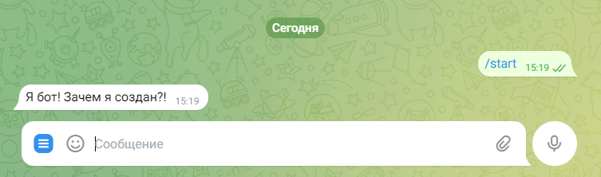
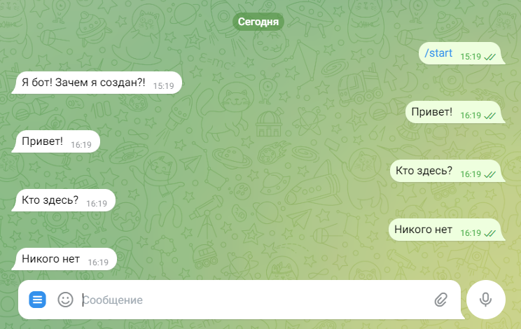
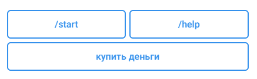
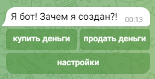

## Необходимые необходимости

* python <=3.11, скачать - [здесь](https://www.python.org/downloads/release/python-3110/)

## Полезные ссылки

* [документация библиотеки python-telegram-bot](https://docs.python-telegram-bot.org/en/v13.13/)
* [примеры ботов, написанные разработчиками библиотеки](https://github.com/python-telegram-bot/python-telegram-bot/tree/v13.x/examples)
* [Telegram Bot API](https://core.telegram.org/bots/api)
* [Telegram Bot Features](https://core.telegram.org/bots/features)

## Вместо предисловия

Существует несколько популярных библиотек для написания ботов. Мы воспользуемся одной из них - `python-telegram-bot`.

## Первые шаги

Для начала поговорите с `@BotFather` и получите токен для бота. Инструкция - [здесь](https://core.telegram.org/bots/features#botfather). Далее, установите библиотеку[^1] командой:
```
pip install python-telegram-bot==13.15
```
**Важно:** не забудьте перед этим [создать и активировать виртуальное окружение.](https://pythonchik.ru/okruzhenie-i-pakety/virtualnoe-okruzhenie-python-venv)

Создайте новый файл и вставьте следующий код:

```python
from telegram import Update
from telegram.ext import CallbackContext, CommandHandler, Updater


def start_bot(update: Update, context: CallbackContext) -> None:
    update.message.reply_text('Я бот! Зачем я создан?!')


def main() -> None:
    updater = Updater('TOKEN')
    dispatcher = updater.dispatcher

    dispatcher.add_handler(CommandHandler('start', start_bot))

    updater.start_polling()
    updater.idle()


if __name__ == '__main__':
    main()
```

Теперь рассмотрим происходящее шаг за шагом.

```python
updater = Updater('TOKEN')
```
Здесь мы создаем экземпляр нашего бота, который будет принимать и обрабатывать входящие сообщения. Подробнее - [здесь](https://docs.python-telegram-bot.org/en/v13.13/telegram.ext.updater.html). Замените `'TOKEN'` на токен, полученный у `@BotFather`.

Сам по себе бот ничего не делает. Чтобы добавить функциональность, мы сделаем две вещи. Во-первых, создадим функцию, которая будет обрабатывать сообщения определенного типа:

```python
def start_bot(update: Update, context: CallbackContext) -> None:
    update.message.reply_text('Я бот! Зачем я создан?!')
```

Эта функция будет вызываться каждый раз, когда бот получает команду `/start`. Функция `start_bot` принимает два параметра: `update` - обновление, содержащее всю информацию и данные, поступающие из самого Telegram (например, сообщение, пользователь, выполнивший команду, и т.д.), и `context` - контекст, содержащий информацию о боте и другую опциональную информацию.

Во-вторых, создаем `dispatcher`, распределяющий входящие сообщения по разным обработчикам, и регистрируем в нем хэндлер (обработчик) `CommandHandler`, в который передаем два аргумента - отслеживаемую команду `start` и функцию-обработчик[^2] `start_bot`.

```python
dispatcher = updater.dispatcher
dispatcher.add_handler(CommandHandler('start', start_bot))
```

И, наконец, метод `start_polling` необходим, чтобы отправлять регулярные запросы к серверу Telegram для получения обновлений, а метод `idle` - для остановки бота комбинацией клавиш `Ctrl + C`.

```python
updater.start_polling()
updater.idle()
```

Попробуйте запустить бота, он ответит вам:



Немножко порадуемся и продолжим.

Пока что наш бот отвечает только на команду `/start`, поэтому добавим еще один хэндлер - `MessageHandler`, который обрабатывает входящие сообщения (это может быть текст, картинки, голосовые - все, что мы привыкли называть 'сообщением'). В него передаются два аргумента: фильтр `Filters.text`, выбирающий сообщения отределенного типа (у нас - текст) и функция-обработчик `echo`. Функция `echo` будет повторять любое текстовое сообщение, отличное от команды `/start`:

```python
from telegram import Update
from telegram.ext import CallbackContext, CommandHandler, Filters, MessageHandler, Updater

...

def echo(update: Update, context: CallbackContext) -> None:
    update.message.reply_text(update.message.text)


def main() -> None:
    ...

    dispatcher.add_handler(CommandHandler('start', start_bot))
    dispatcher.add_handler(MessageHandler(Filters.text, echo))

    updater.start_polling()
    updater.idle()
```

**Важно:** порядок обработчиков имеет значение - если `MessageHandler` будет стоять выше, чем обработчик команды `/start`, то именно он перехватит и обработает это сообщение. **Команда - это тоже текстовое сообщение.**

Остановите бота командой `Ctrl + C`, внесите изменения в код и запустите снова:



Ошибок, связанных с порядком обработчиков, можно избежать, если указать хэндлеру `MessageHandler`, что он **не должен** обрабатывать команды. Сделать это можно следующим образом:

```python
dispatcher.add_handler(MessageHandler(Filters.text & ~Filters.command, echo))
```

Здесь `&` - это `and`, а `~` - `not`. Можно прочитать: выбираем текстовые сообщения **и не** выбираем команды.

Пример кода - [здесь](examples/first_bot.py).

## Отправка сообщений

Для отправки сообщений у бота имеется целое семейство методов вида: `send_<что необходимо отправить>`. Подробнее - [здесь](https://docs.python-telegram-bot.org/en/v13.13/telegram.bot.html#telegram.Bot.send_animation). Первым аргументом передаем `id` чата (пользователя), вторым - отправляемую [сущность](https://www.youtube.com/watch?v=VT3OfQXLOHM&t=1s).

Отправка текстового сообщения:

```python
context.bot.send_message(update.effective_chat.id, 'Hello')
```
Отправка фото:

```python
with open('photo.jpg', 'rb') as photo:
    context.bot.send_photo(update.effective_chat.id, photo)
```

Для удобства, в примерах используются шорткаты методов отправки сообщений. Все они имеют вид: `reply_<что необходимо отправить>`; `id` чата передается автоматически:

```python
with open('photo.jpg', 'rb') as photo:
    update.message.reply_photo(photo)
```

## Update

В `update`, помимо сообщения, содержится еще масса полезной информации:

```python
{'message': {'caption_entities': [],
             'channel_chat_created': False,
             'chat': {'first_name': 'Райан',
                      'id': 123456789,
                      'type': 'private',
                      'username': 'RyanGosling'},
             'date': 1715343061,
             'delete_chat_photo': False,
             'entities': [],
             'from': {'first_name': 'Райан',
                      'id': 123456789,
                      'is_bot': False,
                      'language_code': 'ru',
                      'username': 'RyanGosling'},
             'group_chat_created': False,
             'message_id': 10,
             'new_chat_members': [],
             'new_chat_photo': [],
             'photo': [],
             'supergroup_chat_created': False,
             'text': 'Hello'},
 'update_id': 847374009}
```

С его помощью мы можем, например, получить имя пользователя `first_name`:

```python
name = update.message.chat.first_name
```

Второй вариант получения имени - через свойство `effective_user`:

```python
name = update.effective_user.first_name
```

Подробнее об `update` - [здесь](https://docs.python-telegram-bot.org/en/v13.13/telegram.update.html).

## Кнопочки

Хотя боты могут обрабатывать любые текстовые сообщения, предлагать варианты этих самых сообщений бывает чрезвычайно удобно - здесь нам поможет `пользовательская клавиатура`. Для ее создания воспользуемся классом `ReplyKeyboardMarkup`:

```python
from telegram import ReplyKeyboardMarkup, Update
...


def start_bot(update: Update, context: CallbackContext) -> None:
    keyboard = ReplyKeyboardMarkup(
        [
            ['/start', '/help'],
            ['купить деньги']
        ],
        resize_keyboard=True,
        one_time_keyboard=True
    )
```

Обратите внимание: каждый вложенный список представляет собой отдельный ряд кнопок, а каждый элемент этого списка - кнопка. С помощью параметра `resize_keyboard` подстроим размер клавиатуры под устройство (особенно актуально для мобильных телефонов), а параметр `one_time_keyboard` будет скрывать клавиатуру после нажатия любой кнопки на ней.



Отправим клавиатуру вместе с сообщением:

```python
def start_bot(update: Update, context: CallbackContext) -> None:
    keyboard = ReplyKeyboardMarkup(...)
    update.message.reply_text('Я бот! Зачем я создан?!', reply_markup=keyboard)
```

Тут стоит сказать, что каждая такая кнопка будет оправлять только указанное на ней сообщение, и ничего больше. Подробнее о `ReplyKeyboardMarkup` - [здесь](https://docs.python-telegram-bot.org/en/v13.13/telegram.replykeyboardmarkup.html).

Пример кода - [здесь](examples/reply_keyboard_bot.py).

**Важно:** иногда гораздо удобнее разместить некоторые команды, например `/start` или `/help`, в `меню` бота. Подробнее о `меню` - [здесь](https://core.telegram.org/bots/features#menu-button). Для настройки меню обратитесь к `@BotFather`, выберите (или введите) команду `/setcommands`, после чего следуйте инструкции. Подробнее о командах `@BotFather` - [здесь](https://core.telegram.org/bots/features#botfather-commands).

## Фильтрация входящих текстовых сообщений

Рассмотрим такую ситуацию: нам нужно по-разному обработать следующие сообщения: `купить деньги` и `продать деньги`, и еще отделить их от прочих текстовых. Поступим следующим образом - добавим три хэндлера. Первые два будут перехватывать интересующие нас сообщения, третий - все остальные текстовые.

Для реализации задуманного воспользуемся `Filters.regex`, который фильтрует обновления `update` путем поиска определенного паттерна в тексте сообщения. Дополнительно добавим в паттерны символы начала `^` и конца строки `$`. Они помогут выбрать сообщение **полностью** соответствующее шаблону:

```python
def buy_money(update: Update, context: CallbackContext) -> None:
    ...


def main() -> None:
    ...

    dispatcher.add_handler(MessageHandler(Filters.regex('^купить деньги$'), buy_money))
    dispatcher.add_handler(MessageHandler(Filters.regex('^продать деньги$'), sell_money))
    dispatcher.add_handler(MessageHandler(Filters.text, keep_quiet_with_smart_look))

    updater.start_polling()
    updater.idle()
```

**Важно:** обратите внимание на порядок хэндлеров.

Подробнее о `Filters.regex` - [здесь](https://docs.python-telegram-bot.org/en/v13.13/telegram.ext.filters.html#telegram.ext.filters.Filters.regex).

Пример кода - [здесь](examples/filter_regex_bot.py).

## Inline-клавиатура

Бывают моменты, когда необходимо совершать какие-либо действия, не отправляя боту никаких сообщений - например, менять настройки, переключать параметры и т. д. В таких случаях мы можем использовать `inline-клавиатуру`, которая отображается непосредственно под сообщением.

Для начала создадим список inline-кнопок с помощью `InlineKeyboardButton`. Принцип тут точно такой же, как и у обычной клавиатуры:

> каждый вложенный список представляет собой отдельный ряд кнопок, а каждый элемент этого списка - кнопка

В `InlineKeyboardButton` необходимо передать `text` - надпись на кнопке и один из опциональных параметров: `url`, `callback_data` и некоторые другие.

```python
from telegram import InlineKeyboardButton, InlineKeyboardMarkup, Update
...


def start_bot(update: Update, context: CallbackContext) -> None:
    buttons = [
        [
            InlineKeyboardButton('купить деньги', callback_data=1),
            InlineKeyboardButton('продать деньги', callback_data=2)
        ],
        [InlineKeyboardButton('настройки', callback_data='settings')]
    ]
```

В нашем случае воспользуемся `callback_data` - это данные, которые будут отправлены боту при нажатии кнопки. Создадим клавиатуру, передав в `InlineKeyboardMarkup` inline-кнопки, и отправим ее вместе с сообщением:

```python
def start_bot(update: Update, context: CallbackContext) -> None:
    buttons = [...]
    keyboard = InlineKeyboardMarkup(buttons)
    update.message.reply_text('Я бот! Зачем я создан?!', reply_markup=keyboard)
```



Подробнее об `InlineKeyboardButton` - [здесь](https://docs.python-telegram-bot.org/en/v13.13/telegram.inlinekeyboardbutton.html), об `InlineKeyboardMarkup` - [здесь](https://docs.python-telegram-bot.org/en/v13.13/telegram.inlinekeyboardmarkup.html).

Пример кода - [здесь](examples/inline_keyboard_bot1.py).

## Обработка нажатия на inline-кнопку

Здесь мы рассматриваем только тот случай, когда в inline-кнопке указан параметр `callback_data`.

Прежде всего зарегистрируем в `dispatcher` хэндлер `CallbackQueryHandler`, для обработки нажатия на inline-кнопку, и передадим ему функцию-обработчик `reply_when_click_on_inline_button`:

```python
from telegram.ext import CallbackQueryHandler
...


def main() -> None:
    ...

    dispatcher.add_handler(CallbackQueryHandler(reply_when_click_on_inline_button))

    updater.start_polling()
    updater.idle()
```

**Важно:** `CallbackQueryHandler` перехватывает нажатие на **любую** из созданных нами inline-кнопок.

Самое интересное происходит в `reply_when_click_on_inline_button`. Сначала получим запрос `query` (экземпляр класса `CallbackQuery`), после чего ответим на него:

```python
def reply_when_click_on_inline_button(update: Update, context: CallbackContext) -> None:
    query = update.callback_query
    query.answer()
```

Подробнее о `CallbackQuery` - [здесь](https://docs.python-telegram-bot.org/en/v13.13/telegram.callbackquery.html).

Если передать методу `answer` какое-либо текстовое сообщение, то пользователю будет показано уведомления в верхней части экрана чата.

**Важно:** после нажатия на inline-кнопку, клиенты Telegram (приложения для ПК и мобильных телефонов) будут отображать `индикатор выполнения` (inline-кнопка будет светиться) до тех пор, пока вы не вызовете `answer`. Следовательно, **необходимо отвечать** даже в тех случаях, когда уведомление пользователя не требуется (например, без указания каких-либо опциональных параметров в методе `answer`).

Теперь сообщим пользователю, что он выбрал, когда нажал на inline-кнопку. Для наглядности изменим `callback_data` двух первых кнопок:

```python
InlineKeyboardButton('купить деньги', callback_data='купить деньги'),
InlineKeyboardButton('продать деньги', callback_data='продать деньги')
```

Объект `query` содержит поле `data`, в котором лежат данные, связанные с inline-кнопкой - у нас это будет информация из `callback_data` выбранной кнопки. Воспользуемся этим:

```python
def reply_when_click_on_inline_button(update: Update, context: CallbackContext) -> None:
    query = update.callback_query
    query.answer()
    query.message.reply_text(f'Вы выбрали: {query.data}')
```

**Важно:** `update.message.reply_text` здесь меняется на `query.message.reply_text`.

Иногда бывает полезно отредактировать сообщение, к которому прикреплена inline-клавиатура. Снова сообщим пользователю его выбор, но на этот раз воспользуемся методом `edit_message_text`:

```python
def reply_when_click_on_inline_button(update: Update, context: CallbackContext) -> None:
    query = update.callback_query
    query.answer()
    query.edit_message_text(f'Вы выбрали: {query.data}')
```

Обязательно проверьте оба эти способа.

Пример кода - [здесь](examples/inline_keyboard_bot2.py).

## Каждой inline-кнопке - по хэндлеру!

Мы вновь оказались в ситуации, описанной в главе [фильтрация входящих текстовых сообщений](#фильтрация-входящих-текстовых-сообщений), но на этот раз вместе с inline-кнопками. Прежде всего, нам понадобится inline-клавиатура:

```python
def start_bot(update: Update, context: CallbackContext) -> None:
    buttons = [
        [
            InlineKeyboardButton('купить деньги', callback_data='купить деньги'),
            InlineKeyboardButton('продать деньги', callback_data='продать деньги')
        ],
        [InlineKeyboardButton('настройки', callback_data='settings')]
    ]
    keyboard = InlineKeyboardMarkup(buttons)
    update.message.reply_text('Я бот! Зачем я создан?!', reply_markup=keyboard)
```

Добавим три хэндлера; в каждом из них, помимо функции-обработчика, укажем `pattern` - шаблон, который будет сопоставляться с содержимым `callback_data`, для того чтобы определить, следует ли обрабатывать `update` этим хэндлером:

```python
def buy_money(update: Update, context: CallbackContext) -> None:
    query = update.callback_query
    query.answer()
    query.message.reply_text('Вы купили 100 денег')

...


def main() -> None:
    ...

    dispatcher.add_handler(CallbackQueryHandler(buy_money, pattern='^купить деньги$'))
    dispatcher.add_handler(CallbackQueryHandler(sell_money, pattern='^продать деньги$'))
    dispatcher.add_handler(CallbackQueryHandler(settings, pattern='^settings$'))

    updater.start_polling()
    updater.idle()
```

Мы использовали регулярное выражение в качестве `pattern`, но это не единственно возможный вариант.

Подробнее о `CallbackQueryHandler` - [здесь](https://docs.python-telegram-bot.org/en/v13.13/telegram.ext.callbackqueryhandler.html).

Пример кода - [здесь](examples/inline_keyboard_bot3.py).

## Разговоры по душам с ботом

Задача перед нами стоит следующая: организовать анкетирование пользователя. Требуется узнать:

1. Имя;
2. Фамилию;
3. Возраст;
4. Номер телефона.

Вопросы задаются по очереди, есть кнопка отмены опроса. После прохождения анкеты, пользователю отправляется сообщение со всей полученной информацией.

В чем сложность? Во-первых, каждый из хэндлеров должен перехватывать только определенное сообщение: имя, возраст и т. д. Регулярные выражения не подойдут - имя от фамилии не отличить. Во-вторых, как соблюдать очередность вопросов? В-третьих, что если потребуется задать вопрос еще раз? Сведем все проблемы к одной - необходимо знать **состояние** бота: на каком шаге анкеты мы сейчас находимся.

Для решения этой задачи создадим **диалог** с помощью хэндлера `ConversationHandler`. Любой диалог должен содержать три обязательных элемента: точки входа, состояния и запасные варианты.

**Точки входа** `entry_points` - список хэндлеров, которые будут инициировать диалог.

**Состояния (шаги)** `states` - словарь, который описывает различные этапы диалога: ключ - название этапа, значение - список хэндлеров, которые обрабатывают входящие сообщения этого этапа.

**Запасные варианты** `fallbacks` - список хэндлеров, которые срабатывают в том случае, если пользователь находится в диалоге, но ни один из хэндлеров текущего состояния не может обработать поступившее сообщение, например, отправлена фотография, хотя ожидалась команда. Также `fallbacks` поможет, в случае необходимости, в любой момент выйти из диалога.

Подробнее о `ConversationHandler` - [здесь](https://docs.python-telegram-bot.org/en/v13.13/telegram.ext.conversationhandler.html).

Для начала добавим хэндлер диалога:

```python
from telegram.ext import ConversationHandler
...


def main() -> None:
    ...

    questionnaire_handler = ConversationHandler(
        entry_points=[MessageHandler(Filters.regex('^Заполнить анкету$'), questionnaire_start)],
        states={
            'name': [MessageHandler(Filters.text, get_name)],
            'surname': [MessageHandler(Filters.text, get_surname)],
            'age': [MessageHandler(Filters.text, get_age)],
            'phone_number': [MessageHandler(Filters.text, get_phone_number)],
        },
        fallbacks=[]
    )

    dispatcher.add_handler(CommandHandler('start', start_bot))
    dispatcher.add_handler(questionnaire_handler)

    updater.start_polling()
    updater.idle()
```

И функции-обработчики:

```python
def questionnaire_start(update: Update, context: CallbackContext) -> str:
    update.message.reply_text('Введите ваше имя:')
    return 'name'

...

def get_phone_number(update: Update, context: CallbackContext) -> int:
    phone_number = update.message.text
    update.message.reply_text('<Здесь будет информация о пользователе>')
    return ConversationHandler.END
```

Пример кода - [здесь](examples/conversation_bot1.py).

Обратите внимание - здесь функции-обработчики возвращают название следующего шага. Если этого не сделать - состояние не изменится.
Последняя функция возвращает 'константу' `END` (или `-1`) для завершения диалога.

Бот функционирует, но еще не в полном объеме: полученные данные не сохраняются для отправки, нет кнопки отмены опроса - поэтому приступим к модернизации.

### Хранение данных

Для хранения и передачи данных от одной функции к другой воспользуемся словарем `user_data` объекта `context` - будем добавлять новую пару при получении ответа на вопрос:

```python
def get_name(update: Update, context: CallbackContext) -> str:
    # здесь в update.message.text содержится имя, отправленное пользователем
    context.user_data['name'] = update.message.text
    update.message.reply_text('Введите вашу фамилию:')
    return 'surname'
```

Останется лишь отправить сообщение со всей полученной информацией:

```python
def get_phone_number(update: Update, context: CallbackContext) -> int:
    phone_number = update.message.text
    update.message.reply_text(
        f'Имя: {context.user_data["name"]}\n'
        f'Фамилия: {context.user_data["surname"]}\n'
        f'Возраст: {context.user_data["age"]}\n'
        f'Номер телефона: {phone_number}'
    )
    return ConversationHandler.END
```

Пример кода - [здесь](examples/conversation_bot2.py).

### Срочно покидаем этот диалог

Добавим возможность прервать диалог по желанию пользователя. Для этого потребуется хэндлер `MessageHandler` и функция-обработчик `cancel`. Хэндлер будет перехватывать сообщение `отмена`, функция - грустить и возвращать 'константу' `END` (для завершения диалога).

**Важно:** хэндлер должен находиться в списке `fallbacks`.

```python
def cancel(update: Update, context: CallbackContext) -> int:
    update.message.reply_text('Очень жаль, что вы так рано уходите')
    return ConversationHandler.END


def main() -> None:
    ...

    questionnaire_handler = ConversationHandler(
        entry_points=[...],
        states={...},
        fallbacks=[MessageHandler(Filters.regex('^отмена$'), cancel)]
    )
```

Правда сбежать из диалога у нас все равно не получится: `отмена` - текстовое сообщение, поэтому может быть перехвачено на **любом** этапе разговора. Исправим.

Для этого укажем каждому хэндлеру словаря `states`, что `отмена` трогать нельзя:

```python
def main() -> None:
    ...

    questionnaire_handler = ConversationHandler(
        entry_points=[...],
        states={
            'name': [MessageHandler(Filters.text & ~Filters.regex('^отмена$'), get_name)],
            'surname': [MessageHandler(Filters.text & ~Filters.regex('^отмена$'), get_surname)],
            'age': [MessageHandler(Filters.text & ~Filters.regex('^отмена$'), get_age)],
            'phone_number': [MessageHandler(Filters.text & ~Filters.regex('^отмена$'), get_phone_number)],
        },
        fallbacks=[MessageHandler(Filters.regex('^отмена$'), cancel)]
    )
```

Избавим пользователя от необходимости писать `отмена` - отправим клавиатуру в первой функции диалога:

```python
def questionnaire_start(update: Update, context: CallbackContext) -> str:
    keyboard = ReplyKeyboardMarkup(
        [
            ['отмена']
        ],
        resize_keyboard=True,
    )
    update.message.reply_text('Введите ваше имя:', reply_markup=keyboard)
    return 'name'
```

Она заменит собой уже существующую с кнопкой `Заполнить анкету`, поэтому, при завершении диалога, будем вновь отправлять клавиатуру с заманчивым предложением:

```python
def get_start_keyboard():
    return ReplyKeyboardMarkup(
        [
            ['Заполнить анкету']
        ],
        resize_keyboard=True,
        one_time_keyboard=True
    )


def start_bot(update: Update, context: CallbackContext) -> None:
    update.message.reply_text('Я бот! Зачем я создан?!', reply_markup=get_start_keyboard())

...

def get_phone_number(update: Update, context: CallbackContext) -> int:
    phone_number = update.message.text
    update.message.reply_text(
        ...,
        reply_markup=get_start_keyboard()
    )
    return ConversationHandler.END


def cancel(update: Update, context: CallbackContext) -> int:
    update.message.reply_text(
        'Очень жаль, что вы так рано уходите',
        reply_markup=get_start_keyboard()
    )
    return ConversationHandler.END
```

**Важно:** не повторяйся.

Пример кода - [здесь](examples/conversation_bot3.py).

### Ничего не меняется

Добавим простенькую проверку возраста - он должен находиться в диапазоне от `0` до `99` лет. Если пользователь сообщил некорректные данные (сейчас мы игнорируем тот факт, что может прийти строка), запросим возраст еще раз, после чего вновь вернем состояние `age`:

```python
def get_age(update: Update, context: CallbackContext) -> str:
    age = int(update.message.text)
    if age < 0 or age > 99:
        update.message.reply_text('Введите ваш возраст:')
        return 'age'
    context.user_data['age'] = age
    update.message.reply_text('Введите ваш номер телефона:')
    return 'phone_number'
```

Бот будет задавать вопрос до тех пор, пока не получит подходящий ответ - только после этого состояние изменится, и диалог продолжится дальше.

Проверку можно провести и по-другому: используя `fallbacks` и регулярное выражение, но это я оставлю на самостоятельную реализацию.

## Форматирование текста сообщения

При отправке информации о пользователе в главе [Хранение данных](#хранение-данных), мы не использовали никакого форматирования сообщения - пришла пора добавить его.

В нашем распоряжении два способа: `Markdown` и `HTML`. Рассмотрим оба.

Сделаем **жирным** информационную часть сообщение с помощью `Markdown` (используем символ `*`):

```python
from telegram import ParseMode
...

def get_phone_number(update: Update, context: CallbackContext) -> int:
    ...
    update.message.reply_text(
        f'*Имя:* {...}\n'
        f'*Фамилия:* {...}\n'
        f'*Возраст:* {...}\n'
        f'*Номер телефона:* {...}',
        ...
        parse_mode=ParseMode.MARKDOWN_V2
    )
    return ConversationHandler.END
```

**Важно:** `ParseMode` содержит два режима: `MARKDOWN` и `MARKDOWN_V2`. Режим `MARKDOWN` является устаревшим, использовать его не рекомендуется.

Теперь тоже самое с помощью `HTML` (используем `<b></b>`):

```python
from telegram import ParseMode
...

def get_phone_number(update: Update, context: CallbackContext) -> int:
    ...
    update.message.reply_text(
        f'<b>Имя:</b> {...}\n'
        f'<b>Фамилия:</b> {...}\n'
        f'<b>Возраст:</b> {...}\n'
        f'<b>Номер телефона:</b> {...}',
        ...
        parse_mode=ParseMode.HTML
    )
    return ConversationHandler.END
```

Какое форматирование выбрать - решать вам.

Подробнее о `форматировании сообщений` - [здесь](https://core.telegram.org/bots/api#formatting-options).

Пример кода - [здесь](examples/conversation_formatting_bot.py).

## Вместо послесловия

Хотя 13 версия больше не поддерживается создателями (последнее обновление вышло в 2022), общие принципы построения бота остаюся незменными. Поэтому, надеюсь, переезд на актуальные релизы не вызовет больших трудностей, а [официальная документация](https://python-telegram-bot.org/) сделает этот процесс еще проще.

[^1]: Мы будем использовать версию `13.15` потому что, начиная с `20` версии, библиотека python-telegram-bot перешла на ассинхронность, что может вызвать некоторые трудности при первом знакомстве. Впрочем, переписать ботов на новые версии библиотеки не составит большого труда - все в ваших руках.

[^2]: Термин, которым я, для простоты, заменяю слово `callback`.
